# Custom C++ Machine Learning Library and Model

<div align="center">


</div>

> A high performance machine learning library written in C++ with GPU acceleration support

A custom machine learning library written in C++.  
If you have a GPU you can select between **Vulkan** or **CUDA** implementations (Vulkan = platform agnostic; CUDA = NVIDIA GPUs)  
If you'd rather run on a CPU, then you can use the custom CPU parallelization or **OpenMP**.

## Features

### **Core Components**

* **`Tensor`** class that uses float32 datatype (this is generally good for models).
* **Tensor Math Operations** (matmul, softmax, argmax, crossentropy loss, etc.) each with CPU multithreaded or GPU versions.
* **Layers**: `Linear`, `Conv2D`, `MaxPool2D`, `ReLU`, `MHA` (Multi-Head Attention), `Embedding`, and more; each implements `forward_pass` and `backward_pass` (meaning it lets you do backpropagation).
* **`Sequential Model`** container with for simple neural networks with `fit()`, `predict()` and other specializations. There is a MNIST image classifier made using this as a demo.
* `Functional Model`** for complex architectures that is massively customizable. There is an **English to Spanish transfomer** to show how this works and a tempelate file that serves as a backbone for you to make a functional model of your own.
---

## Usage Example

```cpp
// Sequential model
Model model(true); // enable GPU
model.add(new Linear_GPU(128));
model.add(new ReLU());
model.add(new Linear_GPU(10));
model.fit(labels, images, epochs=100, lr=0.01f);
```

## Build & Setup

### **Prerequisites**

| Component | Requirement | Status |
|-----------|-------------|---------|
| **Compiler** | C++11 or higher compiler (g++, clang++, or MSVC) | **Required** |
| **OpenMP** | OpenMP library | *Optional* |
| **Vulkan** | Vulkan SDK | *Only for Vulkan GPU version* |
| **CUDA** | CUDA Toolkit | *Only for CUDA GPU version* |

### **Build Instructions**

```bash
git clone https://github.com/gideon116/Cpp_ML.git
cd Cpp_ML
mkdir build
cd build
cmake -DCMAKE_BUILD_TYPE=release .. && make && ./wef
```

## Project Architecture

```mermaid
graph TD
    A[🔢 tensor.h] --> B[layers.h]
    B --> C[model.h]
    A --> D[use_GPU.h]
    D --> B
    C --> E[transformer.cpp]
    C --> F[functional_model_template.cpp]
```

<div align="center">



</div>

### **File Structure**

| File | Description | Purpose |
|------|-------------|---------|
|`tensor.h` | Core tensor operations with CPU/GPU variants | **Foundation** |
|`layers.h` | Neural network layers (CPU: `Linear`, GPU: `Linear_GPU`, `Conv2D_GPU`, etc.) | **Building Blocks** |
|`model.h` | Sequential model container with training loop | **Model Container** |
|`use_GPU.h` | Vulkan compute pipeline wrapper | **GPU Acceleration** |
|`transformer.cpp` | English→Spanish transformer example | **Demo Implementation** |
|`functional_model_template.cpp` | Template for custom architectures | **Development Template** |

---

<div align="center">

**⭐ Star this repository if you find it useful! ⭐**

Made by [gideon116](https://github.com/gideon116)

</div>